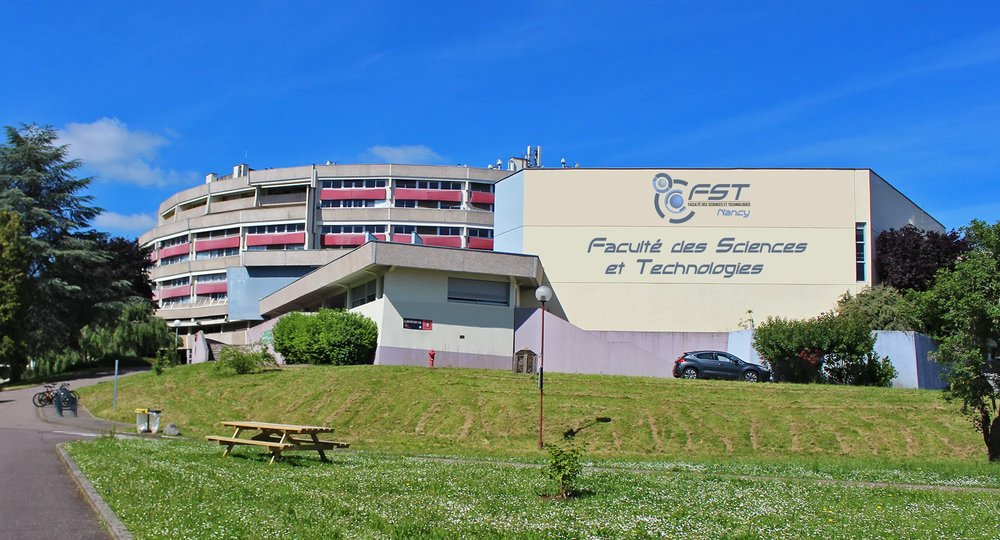

## Geometry of Neural Networks and Tensors in Nancy (2026)

**Location**: Faculté des Sciences et Technologies, Université de Lorraine, Boulevard des Aiguillettes, Vandoeuvre-lès-Nancy.  

**Date**: Wednesday June 10th, 2026.

## About the Workshop
This one-day workshop will focus on the theoretical study of neural networks  and tensor decompositions using geometric tools. The main topic is the geometry of the corresponding algebraic varieties: neurovarieties (in case of neural networks) and secant varieties (for tensor decompositions). For neural networks, understanding  geometry of neurovarieties has proven to be the key to reveal many of their fundamental properties of neural network representation such as their identifiability, expressivity, and the behavior of optimization algorithms (see, for example, [neuroalgebraicgeometry.ai](https://neuroalgebraicgeometry.ai) ). The workhop will present recent developments and discuss connections between neural networks and tensor decompositions.

This is a follow-up of the [workshop on geometry of tensors](https://cran-simul.github.io/tensors-geometry-workshop/) organized in 2025.

## Registration
Registration is free but mandatory (before May 20) [(registration link)](https://forms.gle/P6HLXxzemUQ4rP4Q7)
You are welcome to propose a short talk or poster presentation.

## Invited speakers
- [Kathlén Kohn](https://kathlenkohn.github.io/) (KTH, Stockholm, Sweden)
- [Alex Massarenti](http://mcs.unife.it/alex.massarenti/index.html) (University of Ferrara, Ferrara, Italy)
- [Maksym Zubkov](https://www.maksymzubkov.info/) (University of British Columbia, Vancouver, Canada)

## Preliminary schedule

| **Time**         | **Session**                             |
|------------------|-----------------------------------------|
| 09:30-10:00      | Opening remarks                       |
| 10:00-11:00      | Invited talk #1                       |
| 11:00-11:30      | Coffee break                        |
| 11:30-12:30      | Invited talk #2                       |
| 12:30-14:00      | Lunch break                            |
| 14:00-15:00      | Invited talk # 3                       |                      
| 15:00-17:00      | Contributed talks/poster session       |

## Organizers
- [Ricardo Borsoi](https://ricardoborsoi.github.io) 
- [Marianne Clausel](https://sites.google.com/site/marianneclausel/home)
- [Konstantin Usevich](http://w3.cran.univ-lorraine.fr/konstantin.usevich/)
- [SiMul research group](https://cran-simul.github.io) of [CRAN](https://www.cran.univ-lorraine.fr)
  
Contact: firstname.lastname @ univ-lorraine.fr

---

&copy; 2026 Geometry of  Neural Networks and Tensors in Nancy
