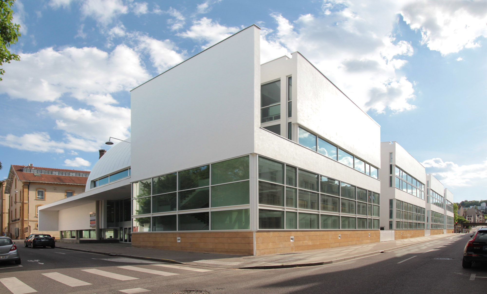
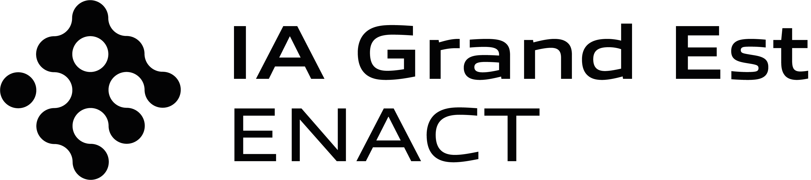
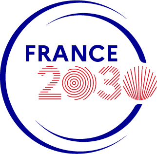
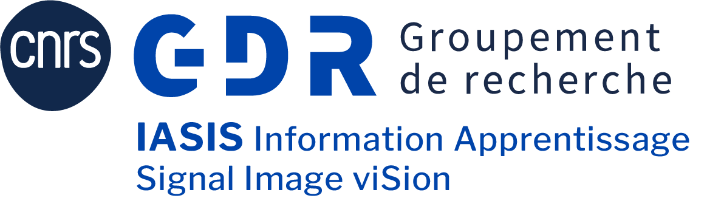

## Geometry of Neural Networks and Tensors in Nancy (2026)

**Location**: IDMC (Institut des Sciences du Digital Management & Cognition), Pôle Herbert Simon, 13 rue Michel Ney, Nancy (rooms 206 / 207).  [How to get there](https://www.openstreetmap.org/directions?engine=fossgis_osrm_foot&route=48.68995%2C6.17449%3B48.69743%2C6.17170#map=16/48.69372/6.17266) from the train station. 

**Date**: 9:15am, Wednesday June 10th, 2026.

## About the Workshop
This one-day workshop will focus on the theoretical study of neural networks  and tensor decompositions using geometric tools. The main topic is the geometry of the corresponding algebraic varieties: neurovarieties (in case of neural networks) and secant varieties (for tensor decompositions). In machine learning theory, understanding  geometry of neurovarieties has proven to be the key to reveal many of their fundamental properties such as their identifiability, expressivity, and the behavior of optimization algorithms (see, for example, [neuroalgebraicgeometry.ai](https://neuroalgebraicgeometry.ai) ). The workhop will present recent developments and discuss connections between neural networks and tensor decompositions.
This is a follow-up of the [workshop on geometry of tensors](https://cran-simul.github.io/tensors-geometry-workshop/) organized in 2025.

The topics of the workshop include, but not limited to: 
 * geometry of low-rank matrix/tensor decompositions
 * geometry of neural networks
 * neurovarieties and secant varieties, X-rank decompositions
 * uniqueness/identifiability of models
 * expressivity
 * optimization and characterization of critical points

## Registration
Registration is free but mandatory (by June 1). You are welcome to present a poster related to the topics of the workshop.

## Invited speakers
- [Kathlén Kohn](https://kathlenkohn.github.io/) (KTH, Stockholm, Sweden)
- [Alex Massarenti](http://mcs.unife.it/alex.massarenti/index.html) (University of Ferrara, Ferrara, Italy)
- [Maksym Zubkov](https://www.maksymzubkov.info/) (University of British Columbia, Vancouver, Canada)

## Schedule

| **Time**         | **Session**                             |
|------------------|-----------------------------------------|
| 08:50-09:15      | Welcome,  coffee + pastries               |
|------------------|------------------------------------------|
| 09:15-09:30      | Opening remarks (from organizers)                     |
| 09:30-10:45      | Kathlén Kohn    *Algebraic Neural Network Theory*  [(abstract)](#kathlen-kohn)  |
| 10:45-11:15      | Coffee break                        |
| 11:15-12:30      | Alex Massarenti   *Bronowski’s Conjecture, Identifiability, and Neurovarieties*   [(abstract)](#alex-massarenti)                    |
| 12:30-14:00      | Lunch   (on site, for registered participants)                    |
| 14:00-15:15     | Maksym Zubkov   *The Interplay of Tensors and Neural Networks*    [(abstract)](#maksym-zubkov)               |         
| 15:15-15:30  |  Poster teasers                  |
| 15:30-17:00      | Poster session + coffee      |

### Confirmed poster contributions 
- Sanyam Agarwal (Saarland University) *The Limits of Tractable Marginalization*
- Ricardo Borsoi (CRAN) *Identifiability of Deep Polynomial Neural Networks*
- Julian Brandon (ENS Paris) *Emergent Riemannian geometry over learning discrete computations on continuous manifolds*
- Antonio Fazzi (CRAN) *Structured low-rank approximation for multiple signal recovery from correlations*
- Chuong Luong (CRAN) *TBD*
- Konstantin Usevich (CRAN) *Uniqueness and algorithms for ParaTuck-2 tensor decompositions*
- Lyuhui Wu (Sorbonne Université) *Convex Analysis and Monge–Ampère Equations on Tropical Varieties*

### Kathlén Kohn 
*Algebraic Neural Network Theory*

**Abstract:** 
The space of functions parametrized by a fixed neural network architecture is known as
its ’neuromanifold’, a term coined by Amari. Training the network means to solve an optimization
problem over the neuromanifold. Thus, a complete understanding of its intricate geometry would
shed light on the mysteries of deep learning. This talk explores the approach to approximate neural
networks by algebraic ones that have semialgebraic neuromanifolds. Such approximation is possible
for any continuous network on a compact data domain. By the universal approximation theorem,
algebraic neural networks are essentially the only ones whose neuromanifolds span finite-dimensional
ambient spaces. In this setting, we can interpret training the network as finding a ‘closest’ point
on the neuromanifold to some data point in the ambient space. This perspective enables us to
understand the loss landscape better, which is the graph of the loss function over the neuromanifold.
In particular, the singularities (and boundary points) of the neuromanifold can cause a tradeoff
between efficient optimization and good generalization: On the one hand, singularities can yield
numerical instability and slow the learning process (which was already observed by Amari). On
the other hand, we will observe how the same singularities cause implicit bias to stable and sparse
solutions. Computing the singularities is often a technical endeavor, and requires us to determine
both the hidden parameter symmetries of the network and the critical points of the network’s
parametrization map. This talk overviews how machine-learning concepts can be formulated in 
algebro-geometric terms and compares 3 popular architectures: multilayer perceptrons, 
convolutional networks, and self-attention networks.

[(back to schedule)](#schedule)

### Alex Massarenti 
*Bronowski’s Conjecture, Identifiability, and Neurovarieties*

**Abstract:** 
I will discuss recent results, obtained in collaboration with Massimiliano Mella, on polynomial neural networks and their associated neurovarieties, focusing on expected dimension, non-defectiveness, and global identifiability. I will then relate these ideas to Bronowski-type criteria for identifiability, including an amended form of Bronowski’s conjecture that reduces identifiability questions to secant defectiveness for a broad class of varieties.

[(back to schedule)](#schedule)

### Maksym Zubkov 
*The Interplay of Tensors and Neural Networks*

**Abstract:**
In this talk, we will explore (neuro)algebraic geometry, an emerging field analogous to algebraic statistics that uses algebraic geometry to study the theory of deep learning. We fix a feedforward neural network architecture with polynomial or rational activation functions and associate an algebraic (neuro)variety to the given architecture. I will present recent results showing how the study of neurovarieties arising from shallow polynomial and rational neural networks connects to several classical questions in algebraic geometry, including Chow varieties, secant varieties of Veronese and Grassmann varieties, Weyl’s conjectures, and other related topics. On the other hand, moving beyond shallow architectures brings a rich collection of classical algebro-geometric objects into focus, whose study may help us better understand the geometry underlying deep learning theory. More broadly, the talk will illustrate how algebro-geometric tools complement the more familiar statistical and probabilistic approaches to the mathematical foundations of deep learning.

[(back to schedule)](#schedule)

## Organizers
- [Ricardo Borsoi](https://ricardoborsoi.github.io) 
- [Marianne Clausel](https://sites.google.com/site/marianneclausel/home)
- [Konstantin Usevich](http://w3.cran.univ-lorraine.fr/konstantin.usevich/)
- [SiMul research group](https://cran-simul.github.io) of [CRAN](https://www.cran.univ-lorraine.fr)
  
Contact: firstname.lastname @ univ-lorraine.fr

---
### Sponsors

This event was supported in part by:
- The PEPR IA project [TENSOR4ML](https://www.pepr-ia.fr/projet/tensor4ml-2/) (ANR-25-PEIA-0003) 
- The [University of Lorraine](https://www.univ-lorraine.fr/), pôle AM2I
- The [IA Cluster ENACT Grand Est](https://cluster-ia-enact.ai/)
- The [CNRS](https://www.cnrs.fr/en)
- The [Réseau Thématique MAIAGES](https://rt-maiages.math.cnrs.fr/) 

<table width="100%" cellspacing="0" cellpadding="0" border="0" style="border-collapse: collapse; border: none;">
  <tr>
    <td align="center" width="15%">
      
    </td>
    <td align="center" width="10%">
      
    </td>
    <td align="center" width="12%">
      
    </td>
    <td align="center" width="15%">
      
    </td>
    <td align="center" width="10%">
      
    </td>
    <td align="center" width="15%">
      
    </td>
    <td align="center" width="12%">
      
    </td>

  </tr>
</table>

---

&copy; 2026 Geometry of  Neural Networks and Tensors in Nancy
