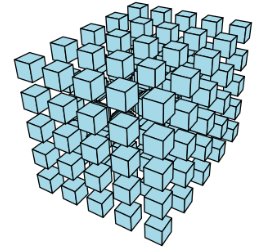

## Workshop on the Geometry of Tensors and Neural Networks (Wednesday 10th June 2026)

**Location**: TDB, Université de Lorraine, rue du Jardin botanique, Villers-lès-Nancy.  [How to get there](https://www.openstreetmap.org/?#map=19/48.666742/6.160048)

**Date**: June 10th, 2026.

## About the Workshop
This one-day workshop will introduce the theoretical study of tensor decompositions and neural networks through the lens of algebraic geometry. Understanding the geometry of these models has proven to be the key to reveal many of their fundamental properties such as their identifiability, expressivity, and the behavior of optimization algorithms. The use geometry is establishing itself as a powerful framework to understand modern algorithms in an increasing number of applications in machine learning, algebraic statistics and signal processing. 

## Registration
Registration is free but mandatory (the capacity is limited). More information coming soon!

## Invited speakers
- [Alex Massarenti](http://mcs.unife.it/alex.massarenti/index.html) (University of Ferrara, Ferrara, Italy)
- [Kathlén Kohn](https://kathlenkohn.github.io/) (KTH, Stockholm, Sweden)
- [Maksym Zubkov](https://www.maksymzubkov.info/) (University of British Columbia, Vancouver, Canada)

---

&copy; 2026 Workshop on the Geometry of Tensors and Neural Networks
